 

I'm a data scientist and computational biologist. Most of my work is spatial
data: imaging mass cytometry, spatial metabolomics and spatial transcriptomics.
I also work with single-cell and bulk RNA-seq, and I build machine learning and
neural network models. I know the deep learning side well.

Now and then I write software that makes analysis easier for people at the
bench. AssayPlot is one of those, and it's public. Most of the research code
isn't yet.

## AssayPlot

<table>
<tr>
<td width="55%">
<a href="https://farishrvat.github.io/assayplot/">
  <picture>
    <source media="(prefers-color-scheme: dark)" srcset="https://raw.githubusercontent.com/FarisHrvat/assayplot/main/docs/assets/screen-figure-dark.png">
    
  </picture>
</a>
</td>
<td>

A free desktop app for lab statistics and publication figures.

43 analyses and 37 plot types, and every procedure is checked against R.
It runs offline on macOS, Windows and Linux. You don't need an account.

**[Website](https://farishrvat.github.io/assayplot/)** ·
**[Download](https://github.com/FarisHrvat/assayplot/releases/latest)** ·
**[Code](https://github.com/FarisHrvat/assayplot)**

</td>
</tr>
</table>

## What I use

**Mostly** 

**When a project needs them** 

**Enough to get by** 

